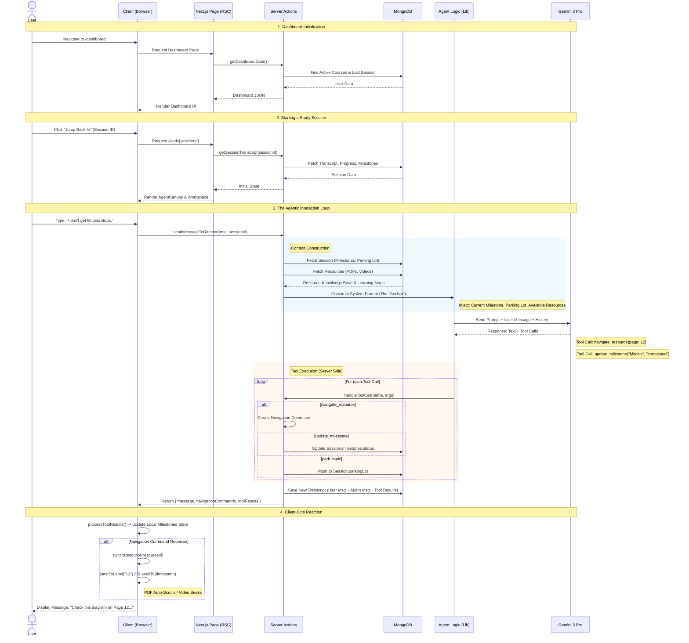

# Studdy: Agentic Study Navigator


**Studdy** is an agentic learning platform that transforms passive study materials into an active, guided learning experience. It uses a **Director Agent** (powered by Google Gemini 3 Pro) to orchestrate a personalized study session, dynamically navigating PDFs and videos, tracking progress, and managing distractions.

Unlike standard chatbots, Studdy has **agency**. It doesn't just answer questions; it drives the session, scrolls your documents, seeks your videos, and negotiates the study plan with you.

---

## Key Features

### 1. **The Director Agent**
A stateful AI companion that acts as your study guide. It maintains a "Session Anchor" to keep you on track and uses a "Mood System" to adapt its teaching style (Guide, Challenger, Supporter) based on your engagement.

### 2. **Multimodal Context**
*   **PDFs**: The agent "sees" your textbooks and lecture slides. It can reference specific pages and auto-scroll the viewer to the relevant diagram.
*   **Video**: The agent analyzes YouTube lectures and can seek the video player to the exact moment a concept is explained.

### 3. **Negotiated Planning**
Don't stick to a rigid schedule. Tell the agent "I only have 20 minutes" or "Focus on the hard stuff," and it will dynamically rebuild your session roadmap in real-time.

### 4. **The Parking Lot**
Stay in the flow. If you have a distracting thought ("Wait, is this related to quantum physics?"), the agent "parks" it for later so you can finish the current mission.

---

## Tech Stack

*   **Framework**: [Next.js 14](https://nextjs.org/) (App Router, Server Actions)
*   **Language**: TypeScript
*   **AI**: [Google Gemini 3 Pro](https://deepmind.google/technologies/gemini/) (via Generative AI SDK)
*   **Database**: MongoDB (Mongoose)
*   **Styling**: Tailwind CSS, Framer Motion
*   **PDF Handling**: `react-pdf`, `pdf-parse`
*   **Video**: `react-player`, `youtube-transcript`
*   **Auth**: NextAuth.js v5

---

## 🏗️ Architecture

The system follows an **Agentic Architecture**:

```mermaid
graph TD
    Client[Client (AgentCanvas)] <--> Server[Server Actions]
    Server <--> DB[(MongoDB)]
    Server <--> Gemini[Gemini 3 Pro]
    
    subgraph "Agent Logic"
        Director[Director Agent]
        Tools[Start / Navigate / Park]
    end
    
    Server --- Director
    Director --- Tools
```

### Agentic Workflow

This sequence diagram illustrates how the **Director Agent** constructs context, plans actions, and drives the UI in real-time.



1.  **Context Construction**: For every message, the server rebuilds the agent's "brain" (Milestones, Parking Lot, Knowledge Base) so it never loses track of the goal.
2.  **Tool Execution**: The agent doesn't just chat; it calls tools (`navigate_resource`) to control the frontend.
3.  **Client Reaction**: The frontend is a "smart puppet" that executes these commands (scrolling PDF, seeking video) instantly.

---

## Getting Started

### Prerequisites
*   Node.js 18+
*   MongoDB Instance
*   Google Gemini API Key


### Installation

1.  **Clone the repository**
    ```bash
    git clone https://github.com/abdushakurob/getstuddy.git
    cd getstuddy
    ```

2.  **Install dependencies**
    ```bash
    npm install
    ```

3.  **Environment Setup**
    Create a `.env.local` file in the root directory:
    ```env
    # Database
    MONGODB_URI=mongodb+srv://...

    # Auth
    AUTH_SECRET=your_auth_secret

    # AI
    GOOGLE_API_KEY=your_gemini_api_key

    # UploadThing (for file storage)
    UPLOADTHING_SECRET=...
    UPLOADTHING_APP_ID=...
    ```

4.  **Run the development server**
    ```bash
    npm run dev
    ```

5.  Open [http://localhost:3000](http://localhost:3000) with your browser.

---

## Project Structure

```
src/
├── app/                 # Next.js App Router pages
├── components/
│   ├── workspace/       # AgentCanvas, PDFViewer, MediaPlayer
│   ├── dashboard/       # Course cards, Sidebar
│   └── landing/         # Marketing pages
├── lib/
│   ├── actions-*.ts     # Server Actions (API Layer)
│   ├── director-agent.ts # Core Agent Logic & Tools
│   └── gemini.ts        # AI Client & Ingestion
├── models/              # Mongoose Schemas (Session, Course, Resource)
```

---

## Contributing

Contributions are welcome! Please feel free to submit a Pull Request.

1.  Fork the project
2.  Create your feature branch (`git checkout -b feature/AmazingFeature`)
3.  Commit your changes (`git commit -m 'Add some AmazingFeature'`)
4.  Push to the branch (`git push origin feature/AmazingFeature`)
5.  Open a Pull Request

---

## License

This project is licensed under the MIT License - see the `LICENSE` file for details.

---

**Built with ❤️ by [AOB](https://github.com/abdushakurob)
