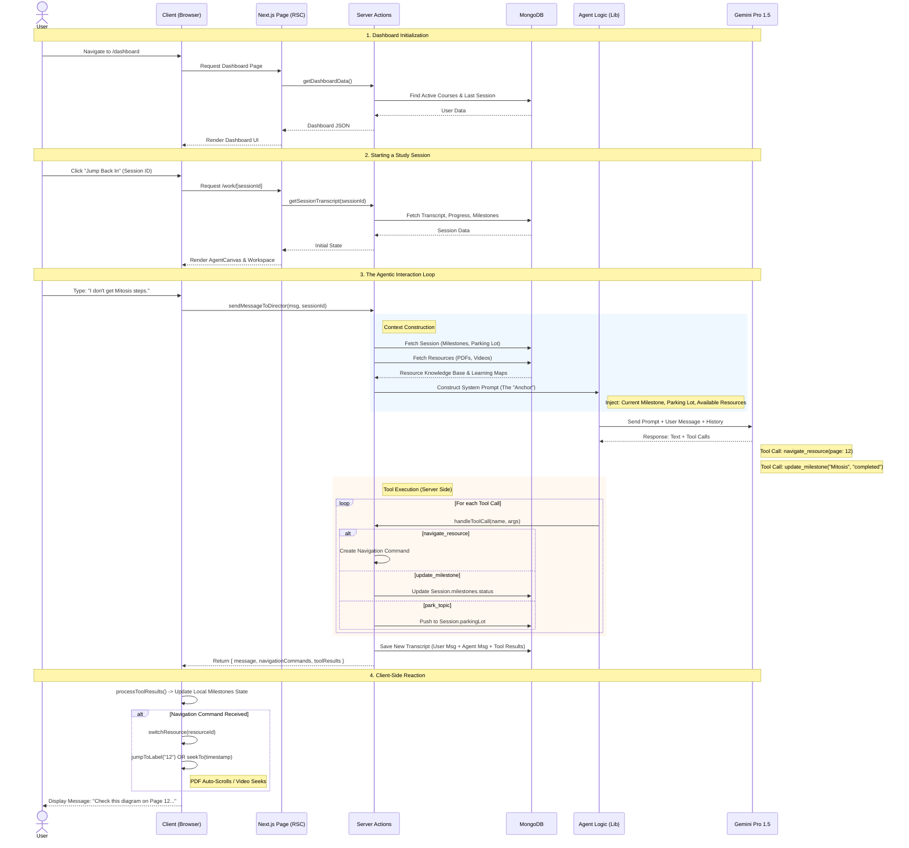

# Studdy: End-to-End System Flow

This sequence diagram illustrates the complete lifecycle of a user interaction within Studdy, from accessing the dashboard to a complex agentic study session.

## System Sequence Diagram

## Key Flow Descriptions

### 1. Context Construction (The "Anchor")
Every time the user sends a message, the server (`actions-director.ts`) rebuilds the **entire cognitive state** of the agent. This is not just a chat history. It includes:
*   **The Roadmap**: Which milestone is currently valid? (e.g., "Intro to Cells" is Done, "Mitosis" is Active).
*   **The Resources**: A list of available PDFs and Videos with their IDs.
*   **The Knowledge Base**: A distilled summary of the *content* creates a "RAG-lite" context window.

### 2. The Tool Execution Loop
Gemini doesn't just reply with text. It replies with **Intent**.
*   If Gemini says "Let's look at page 5", it *must* call `navigate_resource`.
*   The server executes this logic (validating arguments) and returns a **Command** to the frontend.

### 3. The "Puppet" Client
The `AgentCanvas` client is a "smart puppet". It doesn't make decisions; it acts on the Director's commands.
*   It receives `navigationCommands` and mechanically executes them (calling `react-player` or `pdf-viewer` methods).
*   It receives `milestone_update` and optimistically updates the checkbox UI.

### 4. Persistence
All state changes (Parking Lot additions, Milestone completions) are saved to MongoDB *during* the server action, ensuring that if the user refreshes, the "Brain" remembers exactly where they left off.
